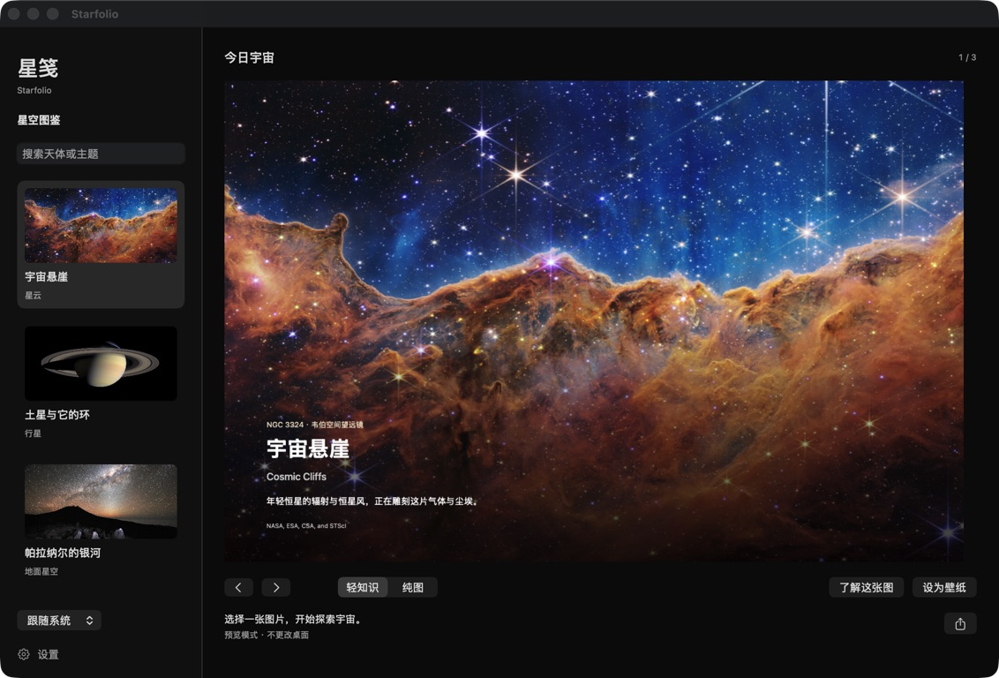

# 星笺 · Starfolio · 스타폴리오

A quiet, native macOS wallpaper app for astronomy. Real observations, a little knowledge, and a clear path back to the source.



## 第一版 / First release / 첫 버전

**中文：** 独立的 macOS 星空壁纸应用。中文、英文、韩文覆盖应用内界面、壁纸短文和知识详情；支持跟随系统或手动切换。内置宇宙悬崖、土星与它的环、帕拉纳尔银河三张精选图片，可离线浏览、搜索、切换纯图与轻知识、设置壁纸、导出 PNG、按小时或每日轮换，以及登录时启动。浏览图片不会立即换桌面。

**English:** An independent macOS astronomy wallpaper app with Chinese, English and Korean interfaces, captions and reading notes. Three curated images work offline: Cosmic Cliffs, Saturn & Its Rings, and Milky Way over Paranal. Browse and search, switch between image-only and short-caption wallpapers, apply to connected displays, export PNG, rotate hourly or daily, and launch at login. Browsing alone does not change the desktop.

**한국어:** 중국어·영어·한국어 인터페이스와 설명을 제공하는 독립형 macOS 천문 배경화면 앱입니다. 우주의 절벽, 토성과 고리, 파라날의 은하수 등 세 가지 엄선된 이미지를 오프라인으로 감상할 수 있습니다. 검색, 이미지 전용 모드와 짧은 설명 모드, 배경화면 설정, PNG 내보내기, 시간별·일별 자동 변경, 로그인 시 실행을 지원합니다. 이미지를 둘러보는 것만으로는 배경화면이 바뀌지 않습니다.

## Run locally

macOS 15 or later, Swift 6.1 or later, Xcode or compatible Command Line Tools. No account, API key or network connection is needed to use the bundled images. Opening source links uses your browser.

```sh
./script/build_and_run.sh             # build and launch dist/Starfolio.app
./script/build_and_run.sh --preview   # isolated UI; never changes the desktop
./script/build_and_run.sh --verify    # packaged resources, translations, image hashes
./script/build_and_run.sh --build     # build the .app without launching it
./script/test.sh
```

The build script signs locally with an ad-hoc signature. This development build is **not Apple-notarized**. A build made from this checkout targets the machine's current architecture; the initial downloadable build is for Apple Silicon. macOS 15 compatibility is declared but has not been exercised on a macOS 15 machine.

The current macOS 27 Command Line Tools SDK lacks its SwiftUI macro plug-in. When the stable macOS 26.5 SDK is also installed, the scripts select it for this build only. They do not change the computer's selected developer tools.

## Using the app

- Choose an image, read its story, then use **Set wallpaper**. Each connected display gets a render sized to its pixel dimensions; the app shows per-display results.
- **Image only** removes the knowledge caption and keeps the image credit. **Export wallpaper** saves a 2560 × 1440 PNG.
- Language and caption-mode changes update a previously applied Starfolio wallpaper. Browsing another image does not apply that selection.
- Rotation defaults to off. Hourly/daily rotation requires the app to remain running. Closing the main window leaves the menu-bar app running; Quit stops it.
- Sleep, display reconnection and Space changes trigger a reapply of the last requested Starfolio image. Arbitrary inactive Spaces and macOS wallpaper changes outside the app are not fully controllable.
- App content uses the selected language. macOS-owned menus, permission prompts and file dialogs may follow the operating system language. Official external sources retain their original language.
- App preferences live in the `com.starfolio.wallpaper` domain. Rendered files live under `~/Library/Application Support/Starfolio/rendered`. Referenced wallpaper files are retained so macOS does not lose its wallpaper after the app exits.

## Shared astronomy content

Starfolio is developed and runs independently of [Sightline / 观物志](https://github.com/ykopp/daydream-wallpaper). Neither app needs the other to be running.

`Packages/CelestialKit` is the canonical astronomy content, translations and renderer. Sightline can vendor a versioned snapshot and include its astronomy cards alongside other categories. Changes reach Sightline when its snapshot is updated and its app is rebuilt; this is not an automatic content subscription.

```sh
python3 script/sync_sightline.py /path/to/Sightline
python3 script/sync_sightline.py /path/to/Sightline --check
```

See [architecture and editorial workflow](docs/ARCHITECTURE.md) and [verification](docs/VERIFICATION.md).

## Images and licensing

Images retain their original credits and usage terms. Code licensing does not relicense photographs. See [image notices](Packages/CelestialKit/IMAGE_NOTICES.md) and the credit/source panel in the app. Wallpapers are resized/cropped as needed and may carry text overlays; original packaged photographs are unchanged. This project is not affiliated with or endorsed by NASA, ESA, CSA, STScI or ESO.

The first release is intentionally a small, reviewed offline collection. It does not yet include live feeds, online content updates, favorites, cloud sync or an app auto-updater. Korean copy has not undergone a separate native-speaker editorial review.
